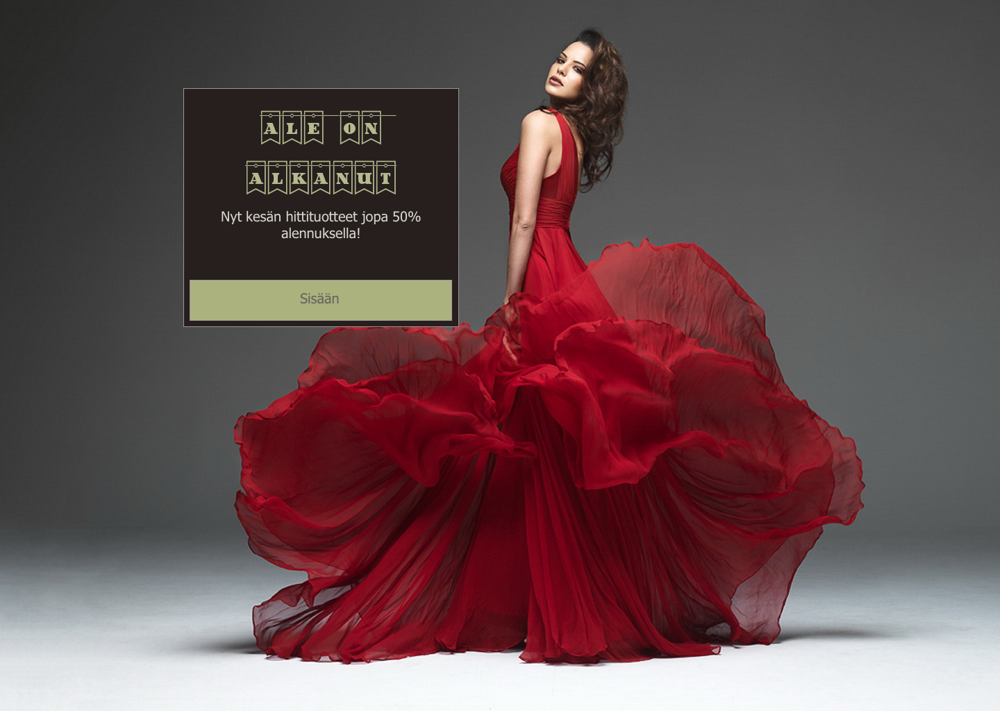
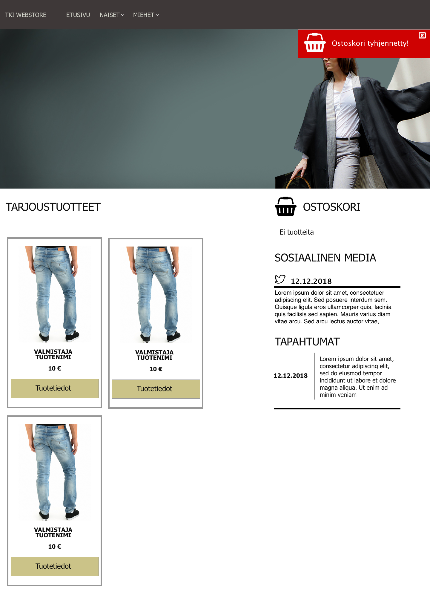

# Verkkosivuston toteutus - Tehtävä 6

## Asennusohjeet
  Sivusto tarvitsee asentuakseen nodejs ympäristön. Ympäristön voit asentaa osoitteesta: https://nodejs.org/en/download/
  Mikäli asennat sivuston githubista, tarvitset Gitin. Gitin voit asentaa osoitteesta: https://git-scm.com/downloads
  
  Asennus GitHubista: 

  ```
    git clone https://github.com/ToniIltanen/VT_T6
  ```

  Sovelluksen käynnistäminen paikallisesti:
  (Komennot ajetaan sovelluskansion sisällä)

  ```
    npm install   // Asentaa tarvittavat paketit
    npm start       // Käynnistää sovelluksen
  ```

  Käynnistämisen jälkeen, sivusto om nähtävissä osoitteesta: 
  ```
    http://localhost:3000
  ```

## Testikäyttö
  Sivustoa voi testikäyttää osoitteessa http://toniiltanen.github.io/VT_T6

  HUOM! Et voi navigoida suoraan muihin osoitteisiin, testikäyttö tapahtuu navigoimalla valikon kautta sovelluksessa.
  (Github Pages ei tue reitityksiä, sovelluksen reititykset tapahtuvat reduxia apunakäyttäen).

  Mikäli käynnistät sivuston normaalisti koneeltasi (tai käytät erillistä backendiä hostaamiseen), voit käyttää myös suoria osoitteita.

## Konseptointi

   ####  Sketch
   Konseptointi on toteutettu Sketch -sovelluksella. 
   Sovellus on maksullinen, ja vaatii toimiakseen macOS Käyttöjärjestelmällä varustetun tietokoneen. 

   Sovelluksesta on saatavilla ilmainen kokeiluversio osoitteesta https://www.sketchapp.com/

   Projektitiedoston löydät kansiosta:
   ```
    /docs/concept/Sketch/verkkokauppa.sketch
   ```
   Tarvittavat lisäfontit (mikäli ei ole asennettu omalle koneelle)

      - Font Awesome
      - Happy Day At School

   Projektissa käytetyt erikoisfontit asennusta varten löydät kansiosta 
   ```
    /docs/consept/fonts
   ````

   Sivukonseptit pdf muodossa löydät tiedostosta
   ```
    /docs/consept/verkkokauppa.pdf
   ```

   ### Sivumallinnukset

   #### Splash
   

   #### Etusivu
   

   #### Tuotesivu
   

   #### Ostoskori
   